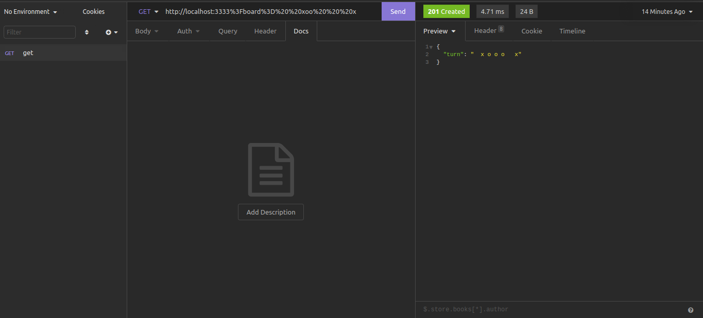

## Requisitos para rodar o sistema local

- node 14+


## Começando 

- Clone o projeto

```git
git clone https://github.com/luannrodrigo/tictoctoe-nodejs.git
```


**Dentro do projeto**

- Configure o .env 

```wnc
# APP
APP_PORT=<Porta que deseja rodar>
NODE_ENV=<TIpo ambiente | producation | develipment>
```


**Instalando as dependências o sistema**

```bash
yarn or npm install
```

**Rodando o sistema**
```bash
yarn dev:server
```
Execute o comando acima para subir o sistema
Acesso em http://localhost<PORT>


**Exemplos de uso**

**### Parametros: %3Fboard%3D%20%20xoo%20%20%20x**

***Local***

url: http://localhost:3333%3Fboard%3D%20%20xoo%20%20%20x



***Web***
**baseUrl**: http://ec2-18-116-230-49.us-east-2.compute.amazonaws.com:3333

url: http://ec2-18-116-230-49.us-east-2.compute.amazonaws.com:3333/%3Fboard%3D%20%20xoo%20%20%20x


Feito com ❤️ por Luann Rodrigo
